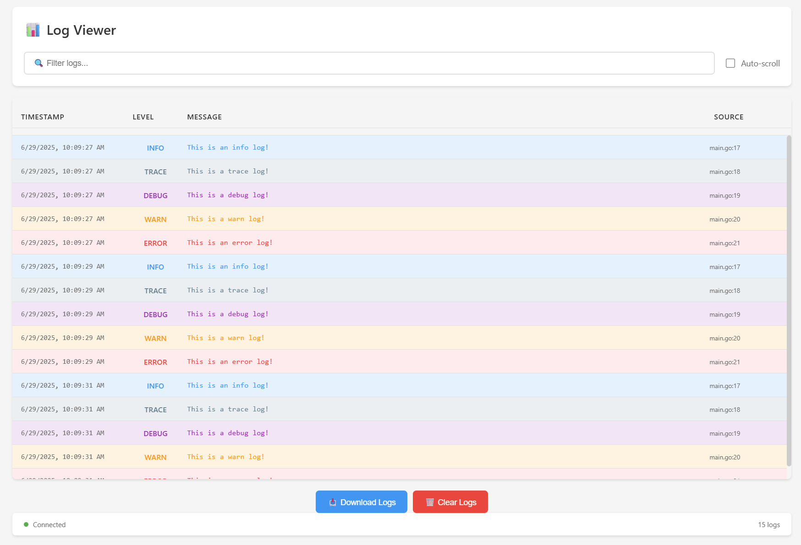

# Log Socket

A real-time log viewer with WebSocket support, written in Go. This tool provides a web-based interface for viewing and filtering logs in real-time.

## Features

- Real-time log streaming via WebSocket
- Web-based log viewer with filtering capabilities
- Support for multiple log levels (TRACE, DEBUG, INFO, WARN, ERROR, PANIC, FATAL)
- Color-coded log levels for better visibility
- Auto-scrolling with toggle option
- Log download functionality
- Log clearing capability
- File source tracking for each log entry

## Installation

```bash
go install github.com/taigrr/log-socket@latest
```

## Example Preview

1. Start the server:

   ```bash
   log-socket
   ```

   By default, the server runs on `0.0.0.0:8080`. You can specify a different address using the `-addr` flag:

   ```bash
   log-socket -addr localhost:8080
   ```

2. Open your browser and navigate to `http://localhost:8080`

   

## Logging Interface

The package provides a comprehensive logging interface with the following methods:

- `Trace/Tracef/Traceln`: For trace-level logging
- `Debug/Debugf/Debugln`: For debug-level logging
- `Info/Infof/Infoln`: For info-level logging
- `Notice/Noticef/Noticeln`: For notice-level logging
- `Warn/Warnf/Warnln`: For warning-level logging
- `Error/Errorf/Errorln`: For error-level logging
- `Panic/Panicf/Panicln`: For panic-level logging
- `Fatal/Fatalf/Fatalln`: For fatal-level logging

## Web Interface Features

- **Filtering**: Type in the search box to filter logs
- **Auto-scroll**: Toggle auto-scrolling with the checkbox
- **Download**: Save all logs as a JSON file
- **Clear**: Remove all logs from the viewer
- **Color Coding**: Different log levels are color-coded for easy identification

## Dependencies

- [gorilla/websocket](https://github.com/gorilla/websocket) for WebSocket support

## Notes

The web interface is not meant to be used as-is.
It functions perfectly well for some scenarios, but it is broken out into a different package intentionally, such that users can add their own as they see fit.
It's mostly here to provide an example of how to consume the websocket data and display it.
